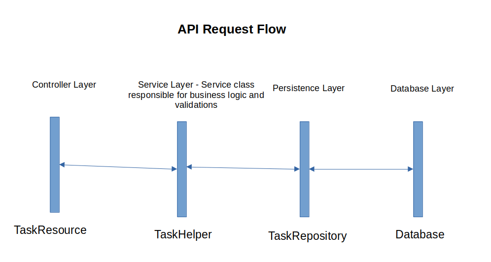
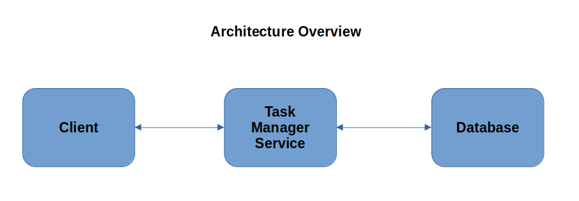

# Task Management System
A Task Management system where tasks may depend on other tasks.
For example: Task B cannot start until Task A is completed.  

A task has the following parameters:  

1. ID: Unique Identifier  
2. Title: Task title  
3. Description: Task description  
4. Status: Task status (TODO / IN_PROGRESS / DONE)  
5. CreatedAt: Creation timestamp  

### Functional Requirements  
• Creating tasks  
• Retrieving task details  
• Updating task status  
• Defining dependencies between tasks  
• Providing a valid execution order based on dependencies  

### Tools used:  

|        Name         |           Tool            |
| :-----------------: | :-----------------------: |
|    **Language**     |          Java 21          |
|    **Framework**    |     Spring Boot 4.0.3     |
|   **Build Tool**    |           Maven           |
|   **Persistence**   |      Spring Data JPA      |
|    **Database**     |        PostgreSQL         |
|   **Containers**    | Docker and Docker Compose |
| **Version Control** |            Git            |

### API Documentation  
* Create Task  
Endpoint: **POST** */service/tasks*  
Request Body: 
```
  {
  "title": String,
  "description": String,
  "dependencies": Set<Long>
  }
```
title: Title of the task  
description: Description of the task  
dependencies: Set of task IDs the current task depends upon  

Response:  
Status: 201 CREATED  

```
{
"title": String,
"description": String,
"dependencies": Set<Long>,
"createdAt": Timestamp,
"id": Long,
"status": Enum
}
```

Status: Error  

```
{
    "statusCode": Integer,
    "message": String
}
```

Sample Request  
Endpoint: **POST** */service/tasks*  
```
  {
  "title": "Task Title",
  "description": "Task Description",
  "dependencies": [1,2]
  }
```

Sample Response:  
Status: 201 CREATED
```
{
"title": "Task Title",
"description": "Task Description",
"dependencies": [1, 2],
"createdAt": "2026-03-15T15:14:03.520050697",
"id": 4,
"status": "TO_DO"
}
```

Sample Request:  
Endpoint: **POST** */service/tasks*  
```
{
    "title": "Task Title",
    "description": "Task Description",
    "dependencies": [55]
}
```

Status: Error 404 NOT FOUND
```
{
    "statusCode": 404,
    "message": "No such task exists. task_id: 55"
}
```

* Retrieve Task  

Endpoint: **GET** */service/tasks/{task_id}*  

Response:  
Status: 200 OK  
```
{
    "title": String,
    "description": String,
    "dependencies": Set<Long>,
    "createdAt": Timestamp,
    "id": Long,
    "status": Enum
}
```
Status: Error  
```
{
    "statusCode": Integer,
    "message": String
}
```
Sample Request:  
Endpoint: **GET** */service/tasks/1*

Sample Response:  
Status: 200 OK
```
{
    "title": "Task Title",
    "description": "Task Description",
    "dependencies": [],
    "createdAt": "2026-03-15T15:13:26.972206",
    "id": 1,
    "status": "TO_DO"
}
```

Sample Request:  
Endpoint: **GET** */service/tasks/100*  

Sample Response:  
Status: 404 NOT FOUND
```
{
    "statusCode": 404,
    "message": "No such task exists. task_id: 100"
}
```

* Update Task  

Endpoint: **PUT** */service/tasks/{task_id}*

Response:  
Status: 200 OK
```
{
    "title": String,
    "description": String,
    "dependencies": Set<Long>,
    "status": Enum
}
```
Status: Error
```
{
    "statusCode": Integer,
    "message": String
}
```

Sample Request  

Scenario: Success. Updation is successful. Task is moved from TO_DO to IN_PROGRESS  

Endpoint: **PUT** */service/tasks/1*  
Request Body:  
```
{
    "title": "Task Title",
    "description": "Task Description",
    "status": "IN_PROGRESS",
    "dependencies": []
}
```

Response:  
Status: 200 OK  
```
{
    "title": "Task Title",
    "description": "Task Description",
    "dependencies": [],
    "createdAt": "2026-03-15T15:13:26.972206",
    "id": 1,
    "status": "IN_PROGRESS"
}
```

Scenario: Failure. Updation has failed. Invalid Task ID is passed in URI.  

Endpoint: **PUT** */service/tasks/55*  
Request Body:  
```
{
    "title": "Task Title",
    "description": "Task Description",
    "status": "DONE",
    "dependencies": [1,2]
}
```
Response:  
Status: 404 NOT FOUND  
```
{
    "statusCode": 404,
    "message": "No such task exists. task_id: 55"
}
```
Scenario: Failure. Updation has failed. Status of Task ID = 2 is moved to DONE from TO_DO directly.  

Endpoint: **PUT** */service/tasks/2*  
Request Body:
```
{
    "title": "Task Title",
    "description": "Task Description",
    "status": "DONE",
    "dependencies": []
}
```
Response:  
Status: 403 FORBIDDEN
```
{
    "statusCode": 403,
    "message": "Invalid task status updation"
}
```

Scenario: Failure. Updation has failed. Task 4 is dependent on Task 1. Now Task 1 is updated to add a dependency on Task 4, resulting in circular dependency.  

Endpoint: **PUT** */service/tasks/1*  
Request Body:
```
{
    "title": "Task Title",
    "description": "Task Description",
    "status": "DONE",
    "dependencies": [4]
}
```
Response:  
Status: 400 BAD REQUEST
```
{
    "statusCode": 400,
    "message": "Invalid dependency added"
}
```

* Retrieve Task Execution Order  
  Endpoint: **GET** */service/tasks/{task_id}/execution-order*

Response:  
Status: 200 OK
```
{
    "task": {
        "id": Long,
        "title": String,
        "description": String,
        "status": Enum,
        "createdAt": TimeStamp,
        "dependencies": Set<Long>
    },
    "executionOrder": [
        {
        "id": Long,
        "title": String,
        "description": String,
        "status": Enum,
        "createdAt": TimeStamp,
        "dependencies": Set<Long>
    },
    {
        "id": Long,
        "title": String,
        "description": String,
        "status": Enum,
        "createdAt": TimeStamp,
        "dependencies": Set<Long>
    }
    ]
}
```
Status: Error
```
{
    "statusCode": Integer,
    "message": String
}
```

Sample Request:  
Scenario: Success. Retrieve Task Execution Order Successful. Task 4 depends on Task 1 and Task 2.  

Endpoint: **GET** */service/tasks/4/execution-order*

Sample Response:  
Status: 200 OK
```
{
    "task": {
        "title": "Task Title",
        "description": "Task Description",
        "dependencies": [
            1,
            2
        ],
        "createdAt": "2026-03-15T15:14:03.520051",
        "id": 4,
        "status": "TO_DO"
    },
    "executionOrder": [
        {
            "title": "Task Title",
            "description": "Task Description",
            "dependencies": [],
            "createdAt": "2026-03-15T15:13:53.066514",
            "id": 2,
            "status": "DONE"
        },
        {
            "title": "Task Title",
            "description": "Task Description",
            "dependencies": [],
            "createdAt": "2026-03-15T15:13:26.972206",
            "id": 1,
            "status": "DONE"
        }
    ]
}
```

Scenario: Failure. Retrieve Task Execution Order Failed. Invalid Task ID is Given.  

Endpoint: **GET** */service/tasks/55/execution-order*  
Sample Response:  
Status: 404 NOT FOUND
```
{
    "statusCode": 404,
    "message": "No such task exists. task_id: 55"
}
```

### API Request Flow  
Task Manager Service follows a layered structure -  
* Controller Layer (TaskResource) - Responsible for accepting the request and returning response from clients.  
* Service Layer (TaskHelper) - Responsible for business logic and input validations.  
* Persistence Layer (TaskRepository) - Responsible for managing interactions with the database.  
* Database Layer - Responsible for storing and retrieving data from database.  



### Architecture Overview  
Task Manager Service follows a Client-Server architecture -  
* Client requests server to create/retrieve/update task and it's dependencies.  
* Server processes the request and returns response. 
 
  

### Design Considerations  
* Enum is used for Task Status (TO_DO, IN_PROGRESS, DONE) - TO_DO=0, IN_PROGRESS=1, DONE=2.  
* By definition a task has the following attributes: *id*, *title*, *description*, *status*, *createdAt*. A new attribute *dependencies* is added in Task which represents many-to-many relationship between tasks. Set<Task> is used as data type for *dependencies*.  
* When creating a task, only *title*, *description* and *dependencies* are required. *status* is set to TO_DO by default, *createdAt* is set to current timestamp, *id* is generated.  
* It is assumed that a task can only move from TO_DO to IN_PROGRESS, and IN_PROGRESS to DONE. No other status updates are valid.  
* When updating a task, a function checks whether updating the task can create cyclical dependencies or not. If a cycle is found, an error is thrown and the task is not updated, else the task is updated.  
* **GET** */service/tasks/{task_id}/execution-order* returns the current task details and a valid execution order of the task serially.  

### Validation and Error Handling  
* When creating a task with non-existing dependent task IDs, or retrieving a task with non-existing task ID, or updating a task with non-existing task ID, or updating a task with non-existing dependent task ID, **NoSuchTaskException** is thrown(Status = 404 NOT FOUND).  
* When updating a task, if a task ID matches with a dependent task ID, **DuplicateTaskException** is thrown(Status = 400 BAD REQUEST).  
* If a task is blocked as its dependencies are not DONE yet, and the task is updated to status IN_PROGRESS, **InvalidOperationException** will be thrown(Status = 403 FORBIDDEN).  
* A task can only move from TO_DO to IN_PROGRESS, and IN_PROGRESS to DONE states. Any other status update throws **InvalidOperationException**(Status = 403 FORBIDDEN).  
* When updating a task, if a cyclical dependency is found, **InvalidDependencyException** is thrown(Status = 400 BAD REQUEST).  
* For any generic exception GlobalExceptionHandler is used.  

### Run In Local
* Prerequisite - Docker and Docker Compose should be installed.  
* Go to Task-manager/task-manager-service/ directory.
* Run ```docker compose up``` from the directory. If getting permission denied error use ```sudo docker compose up```.  
* This will start two services - task-manager-service and postgreSQL service. ```docker ps``` can be used to check the running containers.  
* Base URL will be ```http://localhost:8081```. APIs can be hit appending the endpoints to the base URL. For example, **GET** ```http://localhost:8081/service/tasks/123```.